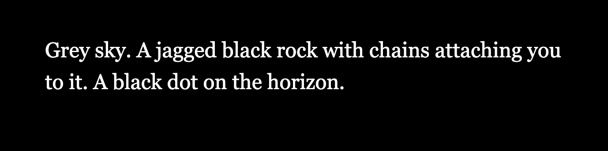
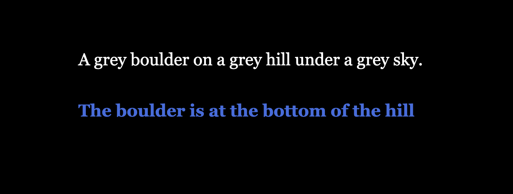
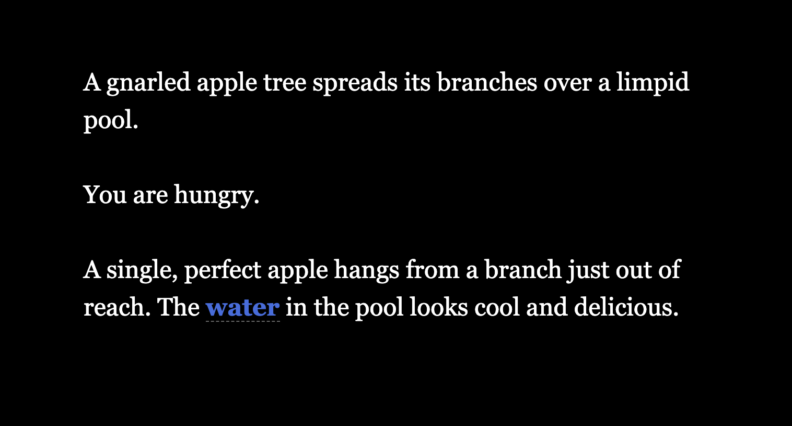
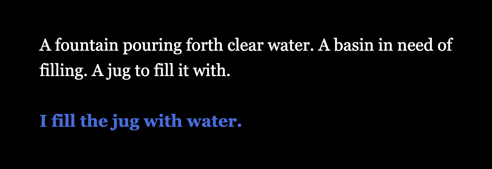
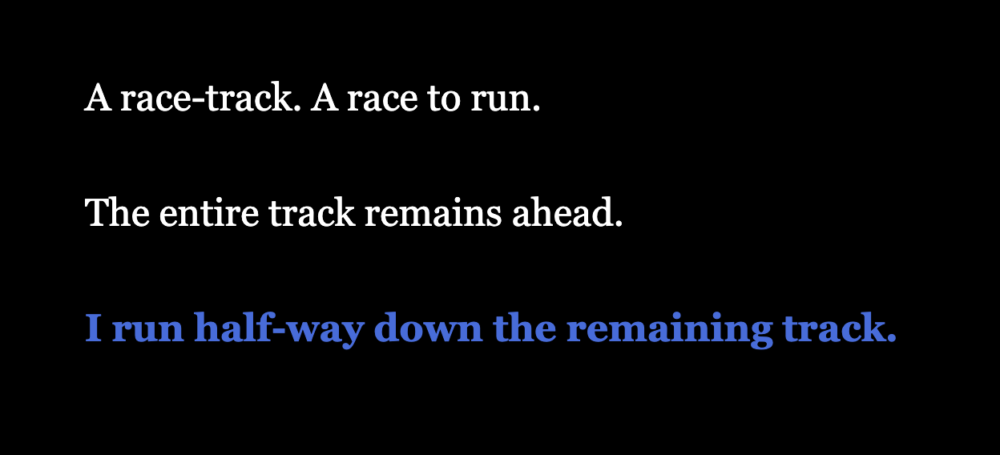

# _Let's Play: Ancient Greek Punishment: The Twine_ Press Kit

_Hypertext! Hyperpunishment! Click links while your heart sinks! Read texts and repent your defects! Enjoy the Twine! Your soul's on the line!_

#### [Play _Let's Play: Ancient Greek Punishment: The Twine_](https://pippinbarr.github.io/lets-play-ancient-greek-punishment-the-twine)

## The basics

* Developer: [Pippin Barr](http://www.pippinbarr.com/)
* Release: 3 July 2019
* Platform: Browser (desktop and mobile)
* Code repository: https://github.com/pippinbarr/lets-play-ancient-greek-punishment-the-twine
* Price: $0.00

## Who is this Pippin Barr guy?

Pippin is an experimental game developer who has made games about everything from [Eurovision](http://www.pippinbarr.com/2012/03/27/epic-sax-game/) to [performance art](http://www.pippinbarr.com/2011/09/14/the-artist-is-present/) to [dystopian post-work futures](http://www.pippinbarr.com/games/2017/07/03/it-is-as-if-you-were-doing-work.html). He's an Assistant Professor in the [Department of Design and Computation Arts](http://www.concordia.ca/finearts/design.html) at [Concordia University](http://www.concordia.ca/) in Montréal. He is also the director of the [Technoculture, Art, and Games (TAG)](http://tag.hexagram.ca/) Research Centre, which is part of the [Milieux Institute for Arts, Culture, and Technology](http://milieux.concordia.ca/).

## Description

_Let's Play: Ancient Greek Punishment: The Twine_ is the ninth edition in the _Let's Play: Ancient Greek Punishment_ series begun in 2011 and comprising: [Let's Play: Ancient Greek Punishment](http://www.pippinbarr.com/games/letsplayancientgreekpunishment/LetsPlayAncientGreekPunishment.html) (2011), [Art Edition Edition](http://www.pippinbarr.com/games/letsplayletsplayancientgreekpunishmentarteditionedition/) (2015), [Limited Edition](http://www.pippinbarr.com/games/letsplayancientgreekpunishmentlimitededition/) (2016), [CPU Edition](http://pippinbarr.github.io/letsplayancientgreekpunishmentcpuedition/) (2017), [Inversion Edition](https://pippinbarr.github.io/lets-play-ancient-greek-punishment-inversion-edition) (2019), [UI Edition](https://pippinbarr.github.io/lets-play-ancient-greek-punishment-ui-edition) (2019), [Teaches Typing](https://pippinbarr.github.io/lets-play-ancient-greek-punishment-teaches-typing) (2019), and [Chess Edition](https://pippinbarr.github.io/lets-play-ancient-greek-punishment-chess-edition). In _The Twine_ the punishments are presented as hypertext fiction using the much-loved story-making software [Twine](http://www.twinery.org/).

## History

_The Twine_ is part of my ongoing idea of essentially spending 2019 making variations on the base _Ancient Greek Punishment_ set of minigames as a way to remain "productive" while in transition to a life with a new baby.

This game has involved engaging with (my perception of) the typical uses of Twine as a story-telling platform and thinking about how to fit my repeated retellings of the punishment myths into this format in an appropriate way. As is usually the case, I've been particularly interested to leverage the various technical aspects available in Twine (cycling links, linked passages, text-modifiers) in order to convey the eternal spirit of the individual punishments in a medium-specific way.

_Let's Play: Ancient Greek Punishment: The Twine_ is also another data-point in the ultra-detailed process documentation approach called [MDMA](http://www.gamesasresearch.com/mdma). So, if you want to, you can read a lot about the game's development by reading its [process documentation](https://github.com/pippinbarr/lets-play-ancient-greek-punishment-the-twine/blob/master/process/README.md), by going through its [commit history](https://github.com/pippinbarr/lets-play-ancient-greek-punishment-the-twine/commits/master), and by reading the [research questions](https://github.com/pippinbarr/lets-play-ancient-greek-punishment-the-twine/blob/master/process/research-questions.md).

## Technology

_Let's Play: Ancient Greek Punishment: The Twine_ was created in [Twine](http://www.twinery.org), a one-stop shop for building simple (or quite complicated) stories for play in the browser, largely based around passages of text connected by hyperlinks.

## License

_Let's Play: Ancient Greek Punishment: The Twine_ is an open source game licensed under a [Creative Commons Attribution-NonCommercial 3.0 Unported License](http://creativecommons.org/licenses/by-nc/3.0/). You can obtain the source code from its [code repository](https://github.com/pippinbarr/lets-play-ancient-greek-punishment-the-twine) on GitHub.

## Features

- Cycling links!
- Cycling passages!
- Cycling passage!
- Inaccessible links!
- Infinite texts!

### Trailer

Frankly, it's not the most visually thrilling experience, you're better off just playing it for a couple of minutes.

## Images

  
Prometheus

  
Sisyphus

  
Tantalus

  
Danaids

  
Zeno

## Press

- Coming soon?

## Additional Links

- [Process documentation of _Let's Play: Ancient Greek Punishment: The Twine](https://github.com/pippinbarr/lets-play-ancient-greek-punishment-the-twine/blob/master/process/README.md)
- [Commit history of _Let's Play: Ancient Greek Punishment: The Twine](https://github.com/pippinbarr/lets-play-ancient-greek-punishment-the-twine/commits/master)

## Credits

* Pippin Barr: basically everything?
* Jim Barr and Mary Barr (aka my parents), Rilla Khaled: testing! Thanks!

## Contact

* Email: [pippin.barr+press@gmail.com](mailto:pippin.barr+press@gmail.com)
* Website: [www.pippinbarr.com](http://www.pippinbarr.com/)
* Twitter: [@pippinbarr](https://www.twitter.com/pippinbarr)
* Instagram: [@pippinbarr](https://www.instagram.com/pippinbarr)
* Facebook: [Pippin Barr](http://www.facebook.com/pippin.barr)
