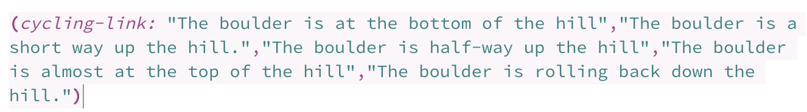
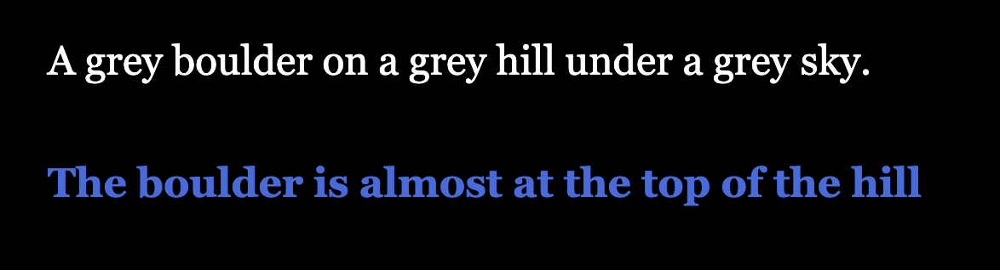
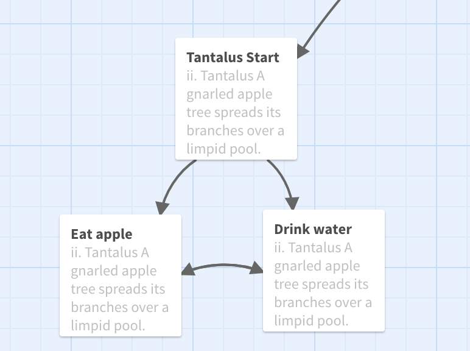
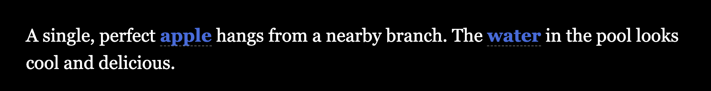
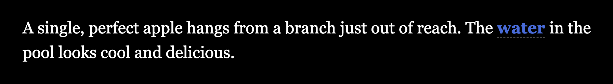
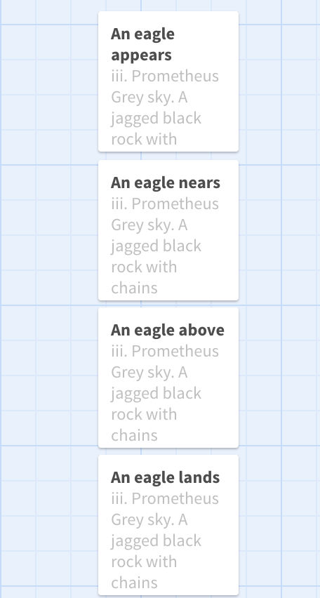
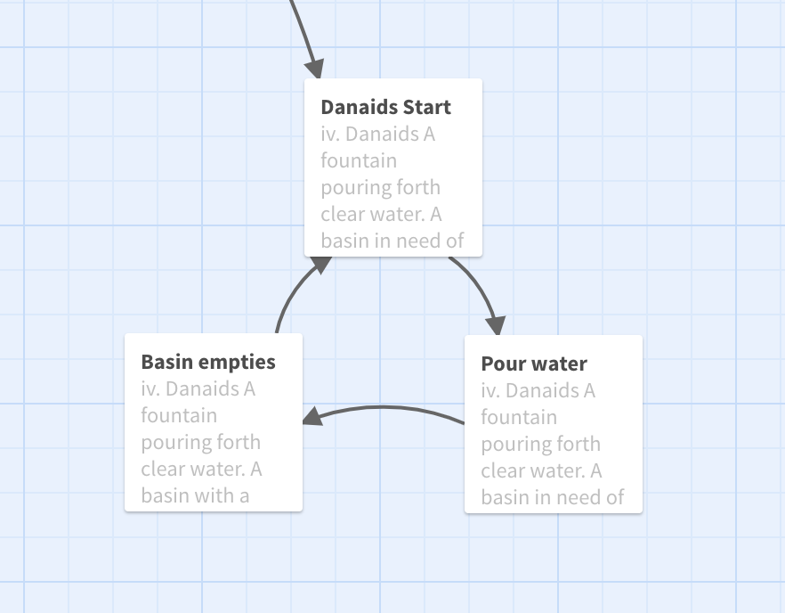
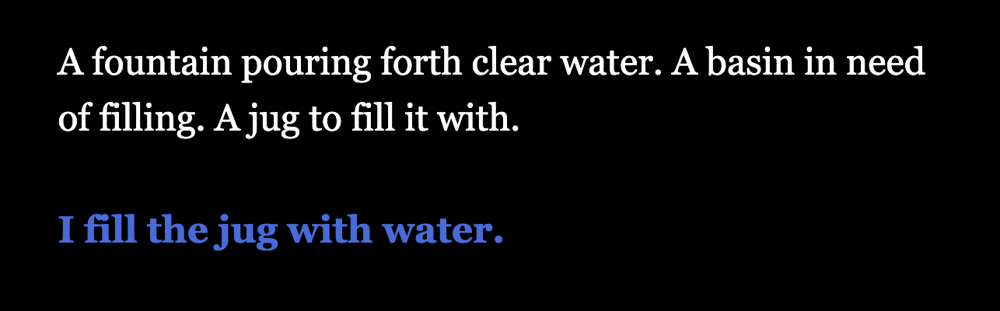
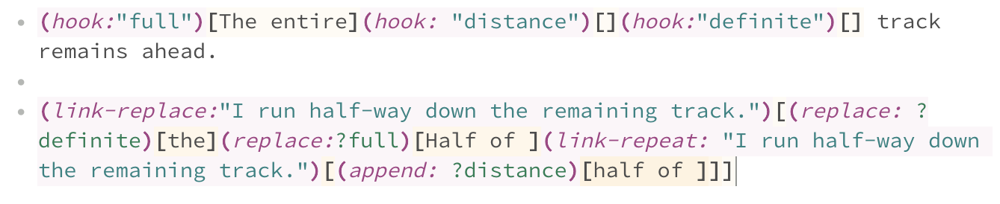
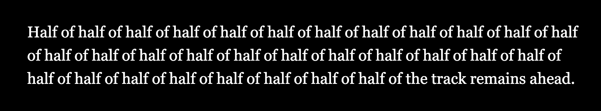

# Let the Punishment Fit the Twine: Ancient Greek Punishments as Hypertexts

(Note: throughout this text, I’ll be linking to [process materials](https://github.com/pippinbarr/lets-play-ancient-greek-punishment-the-twine/blob/master/process/README.md) generated as part of the project in its [code repository](https://github.com/pippinbarr/lets-play-ancient-greek-punishment-the-twine). This approach to process documentation is part of the [Games as Research](https://www.gamesasresearch.com/) project.)

[_Let's Play: Ancient Greek Punishment: The Twine_](https://pippinbarr.github.io/lets-play-ancient-greek-punishment-the-twine) is the ninth edition in the "Ancient Greek Punishment" series I've been working on since 2011. Lately I've been interested in what happens when I retell the five mythological punishments using the "language" of different game engines, and this time around the game engine in question is Twine, an easy-to-use and highly accessible tool for creating hypertext stories.

Each of the myths has the character of being an infinite punishment scenario, the most famous probably being Sisyphus, doomed to push a boulder up a hill only to see it roll back down over and over again. Twine has its own character as a game/story creation tool, in terms of everything from its default stylesheet, to its underlying coding language of "macros", to the typical ways the Twine community uses Twine's features to create their stories. I'm always interested in the intersection between design and the technology in use, so in the following, I want to look particularly at each specific myth and how it interacts with the capacities of Twine through my own design decisions.

## Sisyphus's cyclical situation

I'm not 100% sure why, but I view the "[cycling link](https://twinery.org/wiki/harlowe:cycling-link)" as the emblematic storytelling technique in Twine stories. It's often used in stories in a couple of ways, but perhaps most interestingly as a way to create agency for the reader in determining the actual description of a scene. By cycling through the possibilities of the link, they can set a particular descriptive passage the way they like it, perhaps making a vase contain peonies instead of roses, say.

In planning to make these punishment games in Twine, it was immediately obvious to me that the _cycling_ part of the cycling link would be a great affordance to leverage - after you've seen all the possibilities of the link, it goes back to the first and continues on. As such, it's ideal for representing an endlessly repeating set of options, or in this case _actions_. So Sisyphus's pushing of the boulder is encoded as a cycling link - each advance of the link gets the boulder further up the hill, until the final option sends it rolling back to the bottom, leaving the player back where they started. The code looks like this:

The Twine code for the cycling link in Sisyphus

Something that interests me here and elsewhere in the game is the physicality that you can interpret as part of the interaction here. Each click on the link (or touch on a mobile device) represents a literal _push_ of the boulder in the story - the player exerts effort, however minimal, to advance the text and the boulder itself, the text _is_ the boulder, the cycling link _is_ Sisyphean.

Almost at the top of the hill...

## The apple of your eyes only

Continuing with this idea of physicality, in Tantalus I went with the key action of "reaching" as features in the story. Tantalus is perpetually reaching upward for a piece of fruit or downward for water, but it always thwarted when it moves away. It's another cycle in the sense of reaching, failing, reaching again, and so on, and so the graph of the story is tight loop of two alternating passages, depending on whether you've reached for the apple or the water:

  
No escape from the Tantalus graph

In representing this activity using Twine's affordance, I was taken particularly by the idea of mouseovers on links that would deactivate them, followed by their reactivation on mouse out. I spent a decent amount of time trying to get this work, but the nature of the associated Twine code seemed to make it impossible to have this occur within a single page. Instead, I needed to create separate pages ("passages" in Twine) that would be reached on mouse over, with the appropriate link inactive on that page.

  
Before "reaching" for the apple

  
After "reaching" for the apple

Importantly, this code interaction of mouse-overs really simulates Tantalus's plight for the player. You _literally_ reach (with the mouse pointer) for the "apple" (link), only to have it become inaccessible (the link vanishes). I think this kind of correspondence between played experience and lived experience is particularly interesting, a kind of deeply low-fi approach to the more direct metaphors of alt-control approaches. In the end, I also realised that mobile devices don't have mouse-overs, so I implemented the same action on click/touch, which still fits the physical metaphor well in the sense that a mobile user reaches (with their actual hand) for the link, grasps at it (by touching), and then sees it become inaccessible.

This raises another weird element in videogames generally: the failed action. I'm very intrigued by the emotional state that can be generated by trying and failing, especially in the context of videogames' general drive to provide consistent and constant agency for players.

## The role of the Promethean reader

Speaking of failure, the Prometheus myth has always been my favourite in the Ancient Greek Punishment series of games specifically because of the enforced passivity of the player. In most versions I've made the player can only _struggle_ to stop the eagle pecking out their liver, but ultimately must succumb.

In the case of the Twine rendition, I ended up dropping even the option to struggle because it felt as thought it would turn the experience into too much of a "simulation" (with states concerning where the eagle is, how much liver is left, etc.): this is something Twine _can_ do, but I wouldn't call it a strength. Instead, I went with a favourite Twine affordance: timers. Although they're not used with great frequency (in the Twine's I've frequented), switching pages/passages based on time rather than player input is an interesting switch-up in terms of your experience of the text: pages don't usually turn themselves.

  
Prometheus's passages are connected by time instead of links

In the case of Prometheus, this works out well, since really Prometheus's experience is one of _waiting_. As such, in the Twine version, the reader is presented with a cyclical set of timed passages, one after the other, which describe the inevitability of their liver being pecked out by an eagle. It's a story that tells itself and the player is transformed into solely a _reader_. It's all cut-scene.

## Patterns of hypertext bathwater

The Danaids is the story of a person (well many people in the original myth) condemned to pour water into a leaking basin (or bath, or something), trying futilely to fill it. It's always been the most complex of the myths I've tackled in this set of games because it involves multiple stages of action: filling a receptacle, moving to the basin, pouring the water, seeing the water leak, returning to the filling station, etc.

In the context of Twine, though, this kind of thing is very straightforward and natural: it's a cycle of pages all linked together by the appropriate "actions". It looks like this in Twine:

  
The Danaids' punishment as a cyclical graph

In fact, this is a real classic of hypertext design write large, appearing as [one of the key patterns](https://www.eastgate.com/patterns/Patterns3.html) in the canonical article on the subject [Patterns of Hypertext](https://www.eastgate.com/patterns/Patterns.html) by Mark Bernstein. Unsurprisingly, this was the very first structural affordance of Twine I thought of when I started to tackle this game and I even "saved it" to be applied to whichever of the myths seemed most resistant to other techniques (one of my goals was to avoid exact repetition of any one Twine tool).

One unfortunate side effect of using what feels like such a "literary" hypertext approach is that I think it really does lose any real sense of physicality and is much more in the vein of "select an action/path and see the result", a more typical/conventional experience. It's an ironic truth, I think, that a link that describes an action ends up being nothing like performing that action. It becomes entirely the role of the reader to imagine it.

  
Fetching water in Danaids

## Additive infinity and immobility

The final punishment myth is that of Zeno, not technically a "real myth" per se, but it should be. In this one, Zeno is doomed to run toward a flag he can never reach because of his (highly comical) physics puzzle that motion is impossible because you have to repeatedly get half-way to your destination. This isn't technically a _cycle_ in that Zeno always makes progress, just increasingly smaller progress, and so the challenge is finding a way to represent that.

In the past I've used things like listing the explicit distance to go (while accounting for floating point number overflows!) and even mathematical formulae using sums approaching infinity. Given a hypertext is focused on, well, a text, I didn't want to abbreviate the infinite race, so I went with another classic ability of Twine, which is text expansion/replacement:

  
Twine code for the Zeno passage

It's kind of ugly to look at under the hood, but the outcome is an "additive infinity" where each click of the mouse (not unlike a step taken) adds another "half-way" to the text describing Zeno's progress toward the flag:

  
Twine code for the Zeno passage

This is satisfyingly "literary", but I have to admit that I've abdicated my responsibilities as far as its infinity is concerned. I'm not sure how many "half-way"s it would take to eventually overrun the browser's or JavaScript's ability to display it, but there's presumably some kind of limit.

Eventually infinity comes up against reality.
